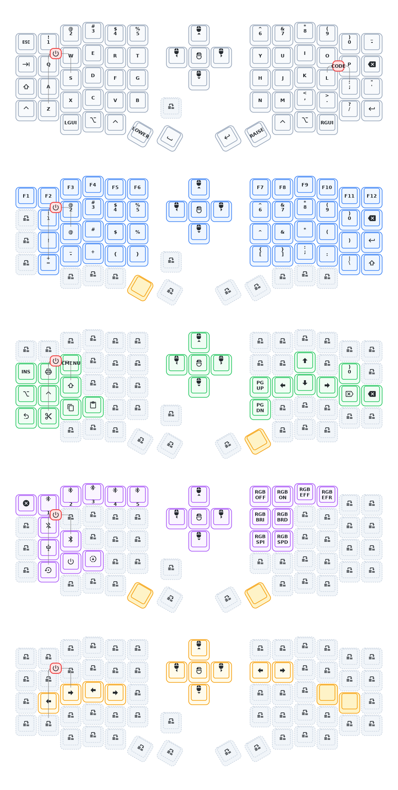

# Adam's Sofle

This repo is a cleaned-up ZMK user-config for a custom Sofle board. The local `boards/` tree is the source of truth for the board definition, `config/` holds the active firmware configuration, and `keymap-drawer/` contains committed diagram output derived from the active keymap.

## Layout

- `BASE`: everyday QWERTY typing
- `SYMS`: F-keys, numbers, brackets, and symbols on the left inner thumb
- `NAV`: arrows, page navigation, and clipboard shortcuts on the right inner thumb
- `UTIL`: Bluetooth, RGB, reset, and power controls when `SYMS` and `NAV` are both held
- `CODE`: macOS programming shortcuts on the outer right Command thumb (`tap = Cmd`, `hold = CODE`)

The CODE layer is aimed at terminal-heavy macOS use:

- `U` / `P`: `Cmd+Left` / `Cmd+Right`
- `I` / `O`: `Option+Left` / `Option+Right`
- `J` / `;`: `Cmd+Shift+Left` / `Cmd+Shift+Right`
- `K` / `L`: `Option+Shift+Left` / `Option+Shift+Right`
- `'`: `Option+Backspace`
- top-right `Backspace`: `Cmd+Backspace`
- `M` / `,`: plain `Backspace` / `Delete`

The only combo left in the active keymap is `Q + S + Z` held for two seconds to enter deep sleep.

## Local Tooling

This repo uses [`mise`](https://mise.jdx.dev/) for local tooling where practical.

1. Install `mise`.
2. Run `mise install`.
3. Install either the Zephyr SDK or GNU Arm Embedded on macOS.
   Example: `brew install arm-none-eabi-gcc`
4. Run `mise run setup`.

Available tasks:

- `mise run setup`: initialize `west` workspace and fetch dependencies
- `mise run update`: refresh `west` dependencies
- `mise run build:left`: build the left half
- `mise run build:left --studio`: build the left half with ZMK Studio enabled
- `mise run build:right`: build the right half
- `mise run build:all`: build both halves
- `mise run draw`: regenerate `keymap-drawer/eyelash_sofle.yaml` and `.svg`
- `mise run clean`: remove local build and fetched dependency state

## Firmware Builds

GitHub Actions builds three artifacts:

- `adams_sofle_studio_left.uf2`
- `adams_sofle_right.uf2`
- `settings_reset-nice_nano_v2-zmk.uf2`

For local builds, `mise` tasks call `west build` against `zmk/app` with `config/` as the active `ZMK_CONFIG` and `BOARD_ROOT` pointed at the repo root so Zephyr can discover the custom board under `boards/`.

The build tasks prefer GNU Arm Embedded automatically when `arm-none-eabi-gcc` is installed. If it is not available, they fall back to the Zephyr SDK environment variables.

## Diagram

The committed diagram is generated from `config/eyelash_sofle.keymap`, not edited by hand.

## Credits

- Board design based on Eyelash Sofle by [a741725193](https://github.com/a741725193)
- Firmware powered by [ZMK](https://github.com/zmkfirmware/zmk)
- Diagram generation powered by [keymap-drawer](https://github.com/caksoylar/keymap-drawer)
